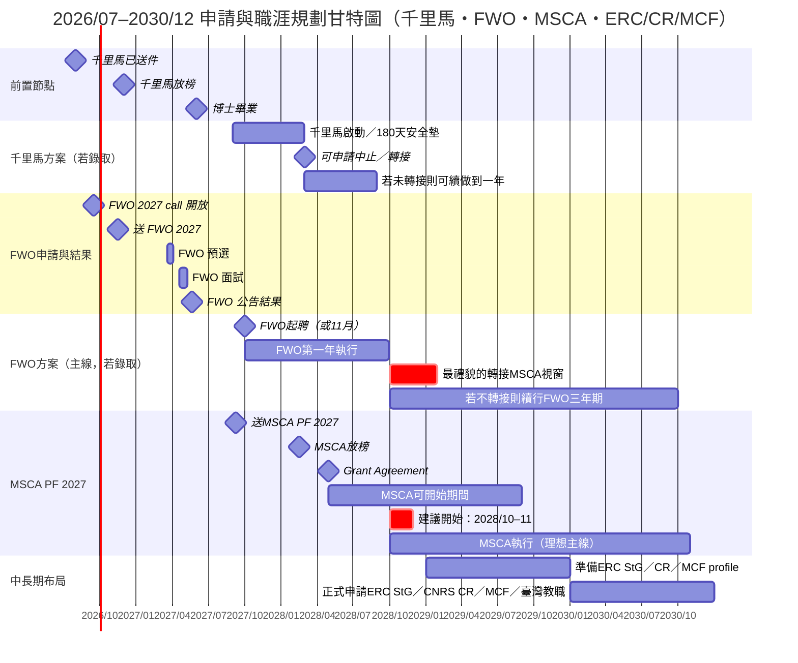

```mermaid
gantt
    title 2026/07–2030/12 申請與職涯規劃甘特圖（千里馬・FWO・MSCA・ERC/CR/MCF）
    dateFormat  YYYY-MM-DD
    axisFormat  %Y/%m

    section 前置節點
    千里馬已送件                    :milestone, ksp_submit, 2026-07-31, 1d
    千里馬放榜                      :milestone, ksp_result, 2026-11-30, 1d
    博士畢業                        :milestone, phd, 2027-06-1, 1d

    section 千里馬方案（若錄取）
    千里馬啟動／180天安全墊          :ksp_180, 2027-09-01, 2028-02-28
    可申請中止／轉接                :milestone, ksp_stop, 2028-03-01, 1d
    若未轉接則可續做到一年           :ksp_1y, 2028-03-01, 2028-08-31

    section FWO申請與結果
    FWO 2027 call 開放              :milestone, fwo_call_open, 2026-09-15, 1d
    送 FWO 2027                     :milestone, fwo_submit, 2026-11-15, 1d
    FWO 預選                        :fwo_preselect, 2027-03-20, 2027-04-05
    FWO 面試                        :fwo_interview, 2027-04-20, 2027-05-10
    FWO 公告結果                    :milestone, fwo_result, 2027-05-21, 1d

    section FWO方案（主線，若錄取）
    FWO起聘（或11月）                :milestone, fwo_start, 2027-10-01, 1d
    FWO第一年執行                   :fwo_y1, 2027-10-01, 2028-09-30
    最禮貌的轉接MSCA視窗             :crit, fwo_transition, 2028-10-01, 2029-01-31
    若不轉接則續行FWO三年期          :fwo_full, 2028-10-01, 2030-09-30

    section MSCA PF 2027
    送MSCA PF 2027                  :milestone, msca_submit, 2027-09-08, 1d
    MSCA放榜                        :milestone, msca_result, 2028-02-15, 1d
    Grant Agreement                 :milestone, msca_ga, 2028-04-30, 1d
    MSCA可開始期間                  :msca_start_window, 2028-05-01, 2029-09-01
    建議開始：2028/10–11            :crit, msca_best_start, 2028-10-01, 2028-11-30
    MSCA執行（理想主線）             :msca_run, 2028-10-01, 2030-10-31

    section 中長期布局
    準備ERC StG／CR／MCF profile     :profile, 2029-01-01, 2029-12-31
    正式申請ERC StG／CNRS CR／MCF／臺灣教職 :applications, 2030-01-01, 2030-12-31
```
