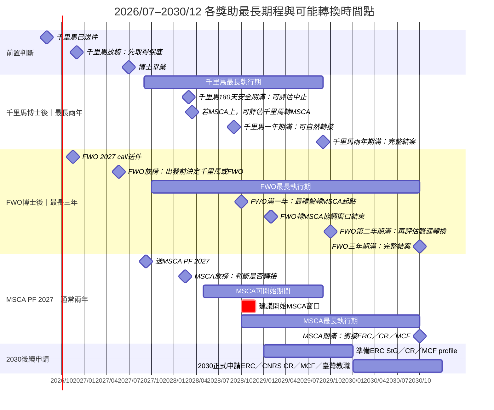

```mermaid
gantt
    title 2026/07–2030/12 各獎助最長期程與可能轉換時間點
    dateFormat  YYYY-MM-DD
    axisFormat  %Y/%m

    section 前置判斷
    千里馬已送件                    :milestone, ksp_submit, 2026-07-31, 1d
    千里馬放榜：先取得保底           :milestone, ksp_result, 2026-11-30, 1d
    博士畢業                        :milestone, phd, 2027-06-30, 1d

    section 千里馬博士後｜最長兩年
    千里馬最長執行期                :ksp_full, 2027-09-01, 2029-08-31
    千里馬180天安全期滿：可評估中止   :milestone, ksp_180, 2028-03-01, 1d
    若MSCA上，可評估千里馬轉MSCA     :milestone, ksp_to_msca, 2028-03-15, 1d
    千里馬一年期滿：可自然轉接        :milestone, ksp_1y, 2028-09-01, 1d
    千里馬兩年期滿：完整結案          :milestone, ksp_2y_end, 2029-08-31, 1d

    section FWO博士後｜最長三年
    FWO 2027 call送件               :milestone, fwo_submit, 2026-11-15, 1d
    FWO放榜：出發前決定千里馬或FWO    :milestone, fwo_result, 2027-05-21, 1d
    FWO最長執行期                   :fwo_full, 2027-10-01, 2030-09-30
    FWO滿一年：最禮貌轉MSCA起點       :milestone, fwo_1y, 2028-10-01, 1d
    FWO轉MSCA協調窗口結束            :milestone, fwo_transition_end, 2029-01-31, 1d
    FWO第二年期滿：再評估職涯轉換      :milestone, fwo_2y, 2029-10-01, 1d
    FWO三年期滿：完整結案             :milestone, fwo_3y_end, 2030-09-30, 1d

    section MSCA PF 2027｜通常兩年
    送MSCA PF 2027                 :milestone, msca_submit, 2027-09-08, 1d
    MSCA放榜：判斷是否轉接            :milestone, msca_result, 2028-02-15, 1d
    MSCA可開始期間                  :msca_start_window, 2028-05-01, 2029-09-01
    建議開始MSCA窗口                :crit, msca_best_start, 2028-10-01, 2028-11-30
    MSCA最長執行期                  :msca_full, 2028-10-01, 2030-09-30
    MSCA期滿：銜接ERC／CR／MCF        :milestone, msca_end, 2030-09-30, 1d

    section 2030後續申請
    準備ERC StG／CR／MCF profile     :profile, 2029-01-01, 2029-12-31
    2030正式申請ERC／CNRS CR／MCF／臺灣教職 :career_apps, 2030-01-01, 2030-12-31
```
