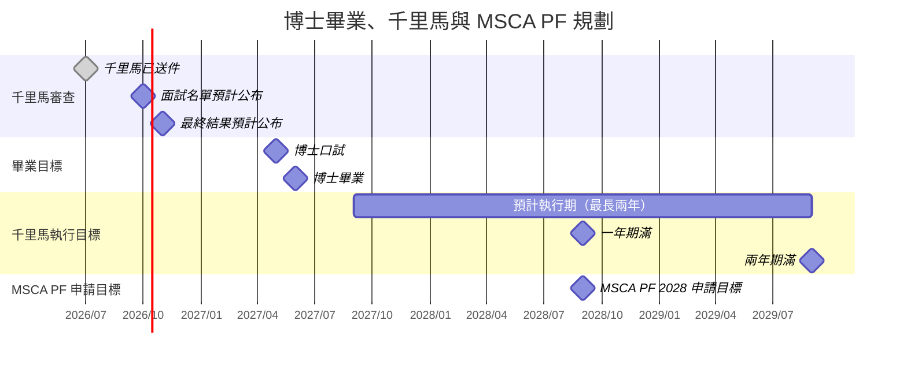

# 博士後規劃路線圖

更新日期：2026-10-04。

比利時主線為已送件的國科會千里馬方案。MSCA PF 目前以 2028 年 9 月申請、2029–2031 年執行為個人目標；實際截止日與執行起迄月份待確認。FWO 2027 已移出現行申請路線。

圖中以月份呈現已送件紀錄與預計節點，年月不代表確切送件截止日或事件日期。千里馬預計於 2026 年 10 月底公布面試名單、11 月底公布最終結果；2027 年 9 月起的執行安排以通過及核定結果為前提。

千里馬執行區間以 2027 年 9 月至 2029 年 8 月表示最長兩年的規劃，圖中 2029 年 9 月為區間終點。MSCA 的 2029–2031 年執行目標尚未確定起迄月份，暫不畫執行區間或轉接日期。

## 千里馬未通過時的 Plan B

下列方案仍待評估，申請與起聘日期未定，先列為候選路徑。

| 候選路徑 | 目前狀態 | 待確認事項 |
| --- | --- | --- |
| 國科會「補助延攬客座科技人才」博士級研究人員管道 | 評估中，作為臺灣博士後候選 | 申請資格、聘任機構、主持人及申請時程 |
| 法國博士後聘任／相近補助制度 | 評估中 | 個別研究計畫或機構職缺、資格、經費及起聘時程 |
| JSPS 博士後（東京優先） | 候選 | 接待機構、適用梯次、申請與起聘時程 |

FWO 2027 原路線已放棄，目前不列為主要備案；若重新考慮，再核對適用年度與時程。ERC StG、CNRS CR、MCF 與臺灣教職保留為後續職涯候選，不沿用舊版的 2030 年固定申請安排。
